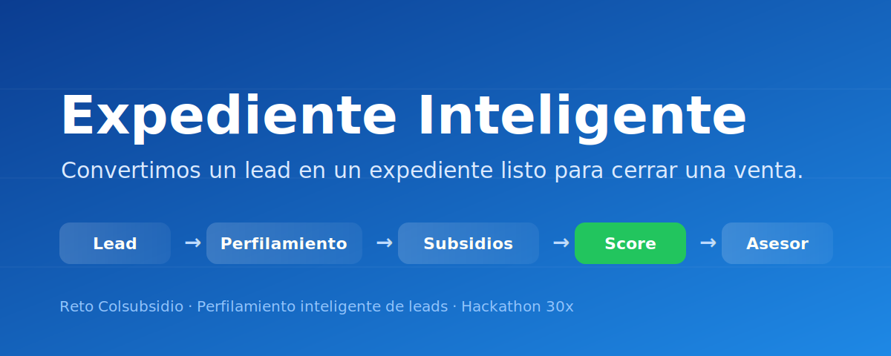
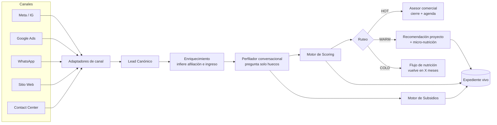

# Expediente Inteligente

> **Convertimos un lead en un expediente listo para cerrar una venta.**

**No calificamos personas. Construimos un expediente vivo** que identifica capacidad de compra, subsidios aplicables, documentos faltantes y recomienda la siguiente acción — **antes** de que el lead llegue al asesor comercial.

<p align="center">
  
  <br/>
  <em>▶️ Reemplazar por GIF de la demo (2 min) antes de presentar — ver <a href="docs/judges.md">guía para jurados</a></em>
</p>

<p align="center">
  <a href="#-problema">Problema</a> ·
  <a href="#-solución">Solución</a> ·
  <a href="#-arquitectura">Arquitectura</a> ·
  <a href="#-demo">Demo</a> ·
  <a href="#-tecnologías">Tecnologías</a> ·
  <a href="#-roadmap">Roadmap</a>
</p>

---

## 🎯 Problema

Colsubsidio invierte en pauta digital y recibe **cientos de leads**. Pero al fondo del embudo:

- Muchos **no tienen capacidad de compra**.
- Muchos **no son afiliados** — y por la regla regulatoria **90/10**, solo el 10% de las ventas puede ir a no afiliados.
- Muchos **aún no están listos** para comprar hoy.

El asesor pierde tiempo identificando esto **manualmente**, lead por lead. El costo es doble: el **CPL** que ya se pagó por la pauta, y las **horas del equipo comercial** persiguiendo leads que no van a cerrar.

Mientras tanto, los leads **orgánicos** (canales propios de Colsubsidio) convierten muy bien: llegan mejor calificados. La diferencia no es la intención de las personas — es el **estado de calificación** al momento de hablar con el asesor.

📄 Detalle completo → [`docs/problem.md`](docs/problem.md)

## 💡 Solución

Una capa de **calificación e inteligencia** entre el canal pago y el asesor. Recibe leads de cualquier fuente (Meta, Google Ads, WhatsApp, web, contact center), los normaliza a un **modelo canónico**, y construye un **Expediente Inteligente** que:

1. **Distingue afiliado / no afiliado** desde el inicio (filtro regulatorio 90/10).
2. **Infiere o valida capacidad de compra** — rango de ingreso, subsidios aplicables, vivienda actual, situación crediticia — con la data que ya trae el lead y preguntando **solo lo que falta**, sin sentirse un interrogatorio.
3. **Prioriza con un score explicable** → los leads listos van directo al asesor; los que aún no pueden, entran a un flujo de **nutrición**.
4. **Recomienda proyectos** acordes al perfil, no todo el catálogo.
5. Funciona **de punta a punta sin intervención humana**.

> **Meta:** que los leads pagos se parezcan a los orgánicos. Que lo que llegue al asesor sea prácticamente conversación de **cierre y agendamiento**, no de exploración.

📄 Filosofía completa → [`docs/solution.md`](docs/solution.md)

## 🏗 Arquitectura



**Un solo cerebro, muchas bocas.** La lógica no depende del canal: cada canal es un adaptador hacia el mismo modelo de lead. Así la solución **escala** más allá de WhatsApp.

📄 Detalle técnico → [`docs/architecture.md`](docs/architecture.md)

## 📊 Datos y evidencia

Esto **no es un mock**: el diseño se apoya en **4.142 compradores reales** de Colsubsidio (2024–2026), entregados como recursos del reto → [`recursos/`](recursos/).

Hallazgos que sostienen la solución:

- **La tesis del reto está probada:** el canal **web (orgánico) trae 83.5% de afiliados** vs. ~73% de Redes/Whatsapp. El canal es señal de calidad.
- **Colsubsidio conoce todo del afiliado, nada del no-afiliado:** el 100% de los no-afiliados llega sin datos de perfil; el afiliado llega completo. Esto valida la doctrina **inferir antes de preguntar**.
- **Segmentación oficial de la caja** (Básico / Medio / Alto / Joven) reemplaza cualquier supuesto.
- **20 proyectos reales** con brochure + tour 360 alimentan el recomendador.

📄 Análisis completo → [`docs/data-insights.md`](docs/data-insights.md) · Diccionario de datos → [`recursos/README.md`](recursos/README.md)

## 🎬 Demo

**El jurado recorre el flujo completo sin ayuda en ~2 minutos:**

1. Entra a la app.
2. Crea un expediente (o simula un lead entrante).
3. Ve cómo se llena el perfil con pocas preguntas.
4. Ve el **score con su razón** (por qué HOT / WARM / COLD).
5. Ve los **subsidios aplicables**.
6. Ve las **recomendaciones de proyecto**.

📄 Guía paso a paso → [`docs/judges.md`](docs/judges.md) · Guion de demo → [`planning/demo-script.md`](planning/demo-script.md)

## 🧠 Motor de Scoring

El expediente no es una caja negra. Cada lead se evalúa en dimensiones explicables:

| Dimensión | Qué mide |
|---|---|
| Score financiero | Ingreso vs. cuota estimada del proyecto |
| Score afiliación | Afiliado a Colsubsidio (peso 90/10) |
| Score subsidio | Subsidios aplicables y su impacto en cuota inicial |
| Score intención | Urgencia y señales de compra |
| Score documentos | Completitud del expediente |
| **Confidence Score** | Qué tanto se infirió vs. se validó |
| **Prioridad** | HOT / WARM / COLD + orden de atención |

📄 Ingeniería del motor → [`docs/scoring-engine.md`](docs/scoring-engine.md)

## 🛠 Tecnologías

- **Frontend:** _(por definir — ver [`frontend/`](frontend/))_
- **Backend / API:** _(por definir — ver [`backend/`](backend/), [`api/`](api/))_
- **IA / LLM:** perfilamiento, extracción de datos, resumen de expediente — prompts versionados en [`prompts/`](prompts/)
- **Motor de subsidios:** reglas VIS/VIP, Mi Casa Ya, Subsidio Familiar de Vivienda (SFV) — ver [`docs/scoring-engine.md`](docs/scoring-engine.md)
- **Automatización:** _(n8n / workflows — ver [`automation/`](automation/))_
- **Datos:** datasets **reales** derivados de la base del reto en [`datasets/`](datasets/) (ICP, priors por canal, muestra de leads, proyectos)

## 🗺 Roadmap

- [x] Definición de problema, solución y arquitectura
- [ ] MVP: expediente + scoring + subsidios + recomendación
- [ ] Perfilador conversacional multicanal
- [ ] Flujo de nutrición
- [ ] Integraciones reales (CRM, DataCrédito) — _fuera de alcance del hackathon_

📄 Detalle → [`docs/roadmap.md`](docs/roadmap.md)

## 📁 Estructura del repositorio

```text
expediente-inteligente/
├── README.md              ← estás aquí
├── DECISIONS.md           ← por qué tomamos cada decisión de producto
├── docs/                  ← problema, solución, arquitectura, pitch, jurados, data-insights
├── recursos/              ← insumos oficiales del reto (base real 4.142 compradores)
├── planning/              ← visión, backlog, MVP, riesgos, guion de demo
├── prompts/               ← todos los prompts de IA (versionados)
├── datasets/              ← data real derivada de la base (ICP, priors, leads_muestra, proyectos)
├── frontend/ · backend/ · api/ · ai/ · database/ · automation/ · scripts/
```

## 👥 Equipo

_(ver [`planning/roles.md`](planning/roles.md))_

---

<p align="center"><em>Hecho en el Hackathon 30x · Reto Colsubsidio · Perfilamiento inteligente de leads</em></p>
