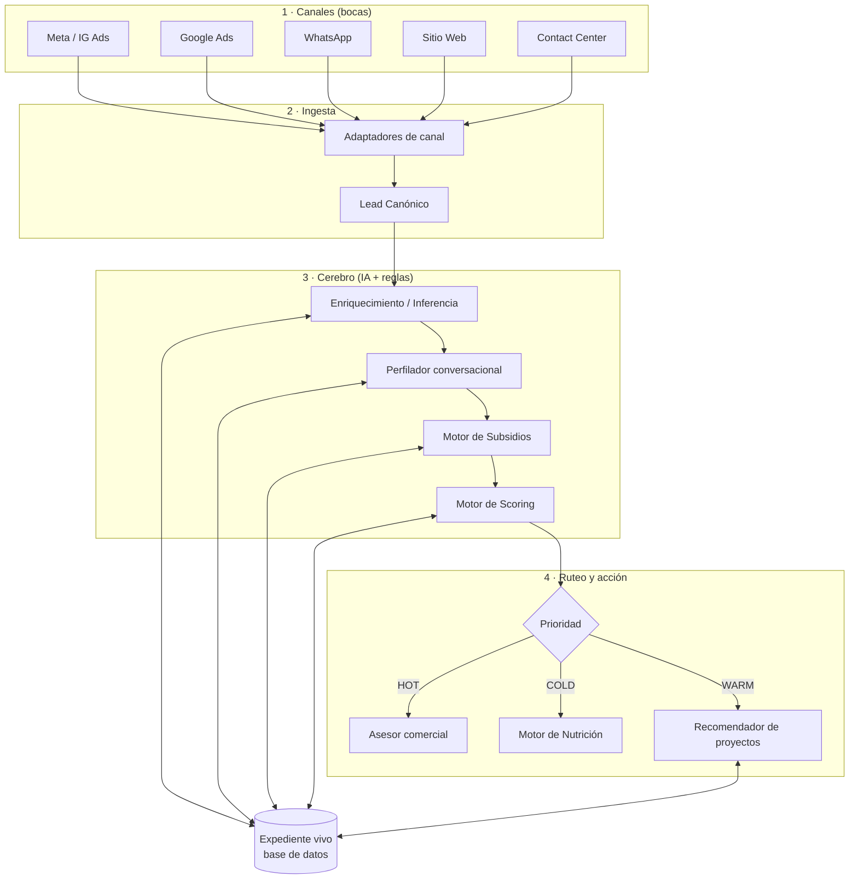

# Arquitectura

> Cómo está construido el sistema. Diseñado para **escalar más allá de un canal** desde el día uno.

## Vista general



## Las 4 capas

### 1 · Canales (las bocas)
Los leads entran por Meta, Google Ads, WhatsApp, sitio web o contact center. **No importa cuántos sean:** cada uno solo necesita un adaptador.

### 2 · Ingesta — el modelo canónico
Cada adaptador traduce su formato al **Lead Canónico**: un esquema único que el resto del sistema entiende. Esta es la pieza que hace que la solución **escale**.

```jsonc
// Lead Canónico (ejemplo)
{
  "id": "lead_0001",
  "fuente": "meta_ads",        // meta_ads | google_ads | whatsapp | web | contact_center
  "campana": "vis-bogota-2026",
  "contacto": { "nombre": "María", "telefono": "+57...", "email": null },
  "senales": {                  // lo que el canal ya nos dio
    "proyecto_interes": "Ciudad Verde",
    "utm": { "term": "casa subsidio bogota" }
  },
  "perfil": {                   // se llena por inferencia + preguntas
    "afiliado": null,
    "ingreso_smmlv": null,
    "tiene_vivienda": null,
    "situacion_credito": null
  },
  "expediente": {               // estado vivo
    "score": null,
    "prioridad": null,
    "subsidios": [],
    "documentos_faltantes": [],
    "siguiente_accion": null
  }
}
```

### 3 · Cerebro (IA + reglas)
- **Enriquecimiento / Inferencia:** deduce lo posible de las señales (canal, campaña, UTM). ¿La campaña era de VIS? Probablemente ingreso bajo-medio. ¿Vino de un formulario de afiliados? Probablemente afiliado.
- **Perfilador conversacional:** pregunta **solo los huecos** con un LLM, de forma natural. Prompts en [`../prompts/`](../prompts/).
- **Motor de Subsidios:** reglas deterministas (VIS/VIP, Mi Casa Ya, SFV). No usa IA — son reglas auditables. Ver [`scoring-engine.md`](scoring-engine.md).
- **Motor de Scoring:** combina las dimensiones en una prioridad **explicable**.

> **Diseño clave:** la IA **extrae y conversa**; las **reglas deciden**. Subsidios y elegibilidad no se alucinan: se calculan de forma determinista. La IA nunca inventa un subsidio.

### 4 · Ruteo y acción
El score determina el destino:
- **HOT** → al asesor, con el expediente completo. Conversación de cierre.
- **WARM** → recomendación de proyecto + micro-nutrición para cerrar huecos.
- **COLD** → flujo de nutrición; vuelve cuando cambien sus condiciones.

## Principios de diseño

| Principio | Implicación técnica |
|---|---|
| Un cerebro, muchas bocas | Modelo canónico + adaptadores por canal |
| IA extrae, reglas deciden | LLM para conversación; motor determinista para elegibilidad |
| Explicable | Cada score guarda su desglose y su razón |
| Sin humano en el loop | El flujo corre end-to-end automáticamente |
| Mock donde no hay integración | CRM, DataCrédito y bot real se simulan con [`datasets/`](../datasets/) |

## Fuera de alcance (simulado con mocks)
- CRM real → mock en `datasets/`
- DataCrédito → señal de crédito simulada
- Bot del contact center → se representa como un canal más

📄 Flujo de usuario → [`user-flow.md`](user-flow.md)
