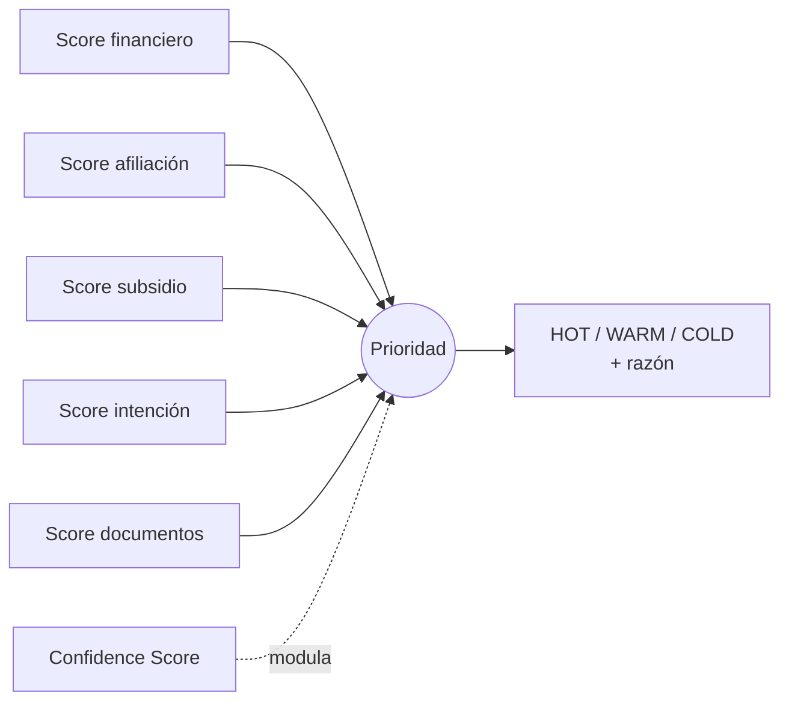

# Motor de Scoring

> Aquí entra la ingeniería. El expediente **no es una caja negra**: cada prioridad se descompone en dimensiones auditables.

## Filosofía: IA conversa, reglas deciden

- La **IA** extrae datos de la conversación y llena el perfil.
- Las **reglas deterministas** calculan elegibilidad de subsidios y el score.

Un subsidio nunca se "alucina". Se calcula con reglas que un auditor de Colsubsidio podría revisar línea por línea.

## Las dimensiones del score



### 1. Score financiero — ¿le alcanza?
Compara el **ingreso** del hogar con la **cuota estimada** del proyecto de interés (regla común: la cuota no debe superar ~30% del ingreso mensual).

```
capacidad_cuota = ingreso_mensual * 0.30
score_financiero = min(1, capacidad_cuota / cuota_proyecto)
```

### 2. Score afiliación — la regla 90/10
El filtro de mayor palanca. Afiliado a Colsubsidio = espacio regulatorio amplio (90%). No afiliado = espacio del 10%, por lo que se **prioriza menos** (pero **no se descarta**).

```
score_afiliacion = 1.0  si afiliado
                   0.3  si NO afiliado   // aún hay 10% de cupo
```

### 3. Score subsidio — ¿cuánto le ayuda el Estado / la caja?
Suma el impacto de los subsidios aplicables sobre la **cuota inicial**. Un lead con subsidios fuertes es mucho más cerrable.

**Reglas de elegibilidad (deterministas):**

| Subsidio | Condición (ilustrativa, en SMMLV) | Efecto |
|---|---|---|
| **VIS** | Vivienda hasta 150 SMMLV | Habilita otros subsidios |
| **VIP** | Vivienda hasta 90 SMMLV | Mayor apoyo estatal |
| **Mi Casa Ya** | Hogar con ingresos ≤ 4 SMMLV, sin vivienda, primer subsidio | Cobertura de cuota inicial + tasa |
| **SFV (Subsidio Familiar de Vivienda)** | **Afiliado** a caja, según rango de ingreso | Aporte directo a cuota inicial |

> ⚠️ Los umbrales exactos (valor del SMMLV, topes por ciudad) se definen como **constantes de configuración** en el motor de subsidios y se actualizan por año. Ver [`../datasets/subsidios.json`](../datasets/subsidios.json).

### 4. Score intención — ¿qué tan caliente está?
Señales de urgencia: proyecto específico en mente, respuestas rápidas, pregunta por sala de ventas, ventana de compra corta.

```
score_intencion ∈ [0,1]  // de señales conversacionales + canal
```

### 5. Score documentos — ¿está completo el expediente?
Completitud de los datos necesarios para avanzar (identidad, ingresos, afiliación, situación de vivienda).

```
score_documentos = campos_completos / campos_requeridos
```

### 6. Confidence Score — ¿cuánto sabemos de verdad?
Distingue lo **validado** de lo **inferido**. Un score alto basado en pura inferencia es menos confiable que uno basado en datos confirmados. El confidence **modula** la prioridad y le dice al asesor qué tan firme es el expediente.

```
confidence = datos_validados / (datos_validados + datos_inferidos)
```

## Cómo se combinan → Prioridad

```
score_global =
      0.30 * score_afiliacion     // 90/10 pesa fuerte
    + 0.25 * score_financiero
    + 0.20 * score_subsidio
    + 0.15 * score_intencion
    + 0.10 * score_documentos

prioridad =
    HOT   si score_global >= 0.70 y confidence >= 0.6
    WARM  si score_global >= 0.45
    COLD  en otro caso
```

> Los pesos son **configurables** y son la principal palanca de negocio: si el cuello de botella es regulatorio, sube el peso de afiliación; si es financiero, sube el de capacidad.

## Ejemplo de resultado (expediente)

```json
{
  "score_global": 0.82,
  "prioridad": "HOT",
  "confidence": 0.75,
  "desglose": {
    "afiliacion": 1.0,
    "financiero": 0.9,
    "subsidio": 0.8,
    "intencion": 0.7,
    "documentos": 0.6
  },
  "razon": "Afiliada a Colsubsidio · ingreso 3 SMMLV cubre cuota de Ciudad Verde · aplica a Mi Casa Ya y SFV · cuota inicial cubierta por subsidios",
  "subsidios_aplicables": ["Mi Casa Ya", "SFV"],
  "siguiente_accion": "Enrutar a asesor · agendar visita a sala de ventas"
}
```

## Por qué explicable importa
El asesor solo confía en el ruteo si entiende **por qué** un lead es HOT. La `razon` en texto claro es lo que convierte el score en una herramienta usable, no en un número mágico.

📄 Datos de subsidios y proyectos → [`../datasets/`](../datasets/)
📄 Prompts de extracción → [`../prompts/`](../prompts/)
