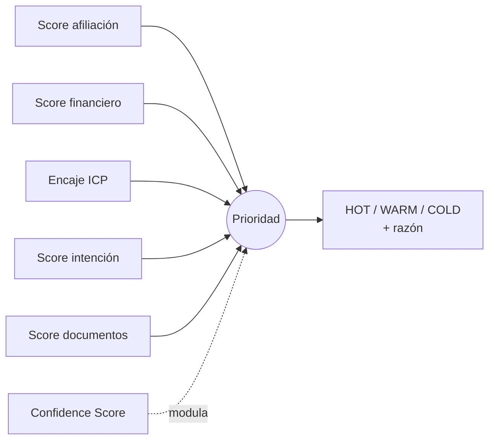

# Motor de Scoring

> Aquí entra la ingeniería. El expediente **no es una caja negra**: cada prioridad se descompone en dimensiones auditables.
> **Recalibrado con data real** — 4.142 compradores de Colsubsidio (2024–2026). Ver evidencia en [`data-insights.md`](data-insights.md). Cero data sintética: los pesos y umbrales se apoyan en distribuciones reales, no en supuestos.

## Filosofía: IA conversa, reglas deciden

- La **IA** extrae datos de la conversación y llena el perfil.
- Las **reglas deterministas** calculan segmento, elegibilidad y score.

Un segmento o subsidio nunca se "alucina". Se calcula con reglas que un auditor de Colsubsidio podría revisar línea por línea.

## Segmentación oficial de la caja (autoritativa)

Fuente: guía oficial del reto → [`../datasets/segmentacion_caja.json`](../datasets/segmentacion_caja.json). **Reemplaza cualquier rango inventado.**

| Segmento | Definición |
|---|---|
| **Básico** | Hasta **1.44 SMLV**, con personas a cargo registradas |
| **Medio** | Entre **1.44 y 20 SMLV**, con grupo familiar |
| **Alto** | Más de **20 SMLV** |
| **Joven** | Menor de **39 años** sin personas a cargo |

Distribución real entre compradores (afiliados): **Básico 47.7% · Medio 28.8% · Joven 23.4% · Alto ~0%**.

## Las dimensiones del score



### 1. Score afiliación — la regla 90/10
El filtro de mayor palanca. En la base, **72.9% de las compras son de afiliados, 25.2% de no afiliados** — la tensión con el cupo regulatorio del 10% es real y medible.

```
score_afiliacion = 1.0  si AFILIADO(A)
                   0.5  si ESTUVO AFILIADO(A)   // reactivable
                   0.3  si NO AFILIADO(A)        // aún hay 10% de cupo, no se descarta
```

### 2. Score financiero — ¿le alcanza?
Compara el rango de ingreso (en SMLV) con el valor del proyecto de interés. La base es **VIS/VIP pura**: **64.7% gana 1–1.5 SMLV y ~78% está por debajo de 2 SMLV**. Un lead en ese rango con proyecto VIS/VIP calza; un lead de ingreso alto interesado en VIS es una anomalía a revisar.

```
score_financiero = encaje(rango_salarial_lead, tipo_vivienda_proyecto)
// alto cuando el ingreso cubre la cuota estimada sin exceder ~30% del ingreso
```

### 3. Encaje ICP — ¿se parece al que sí compra?
Distancia del lead al **perfil real del comprador** (ICP) del proyecto → [`../datasets/perfil_icp.json`](../datasets/perfil_icp.json). Dimensiones: segmento, rango salarial, rango de edad, entidad de crédito, ubicación. Cuanto más se parece al comprador histórico del proyecto, más alto.

> Este es el corazón del reto: **acercar el lead pago al orgánico**. El orgánico ES el ICP; medimos qué tan cerca está cada lead.

### 4. Score intención — ¿qué tan caliente está?
Señales de urgencia: proyecto específico, respuestas rápidas, pregunta por sala de ventas, ventana corta.

### 5. Score documentos — completitud del expediente
Campos necesarios para avanzar. **Asimetría real y crítica:** el **afiliado llega con todo** (segmento, salario, edad, grupo familiar desde los registros de la caja); el **no-afiliado llega 100% vacío**. Ver validación abajo.

```
score_documentos = campos_completos / campos_requeridos
```

### 6. Confidence Score — ¿cuánto sabemos de verdad?
Distingue lo **validado** de lo **inferido**. Para el afiliado, casi todo es dato duro de la caja (confidence alto). Para el no-afiliado, casi todo se pregunta o infiere del **canal** (confidence más bajo).

```
confidence = datos_validados / (datos_validados + datos_inferidos)
```

## Enriquecimiento: prior de afiliación por canal (real)

Antes de preguntar, el canal ya sesga la inferencia. P(afiliado) real por canal → [`../datasets/canal_priors.json`](../datasets/canal_priors.json):

| Canal | P(afiliado) | Ventas |
|---|---|---|
| Página web (orgánico) | 83.5% | 91 |
| Ferias empresariales | 83.0% | 282 |
| Activación | 78.9% | 369 |
| Contact Center | 78.7% | 47 |
| Whatsapp | 74.4% | 125 |
| Redes Sociales | 73.4% | 124 |
| Banderas / señalización | 72.7% | 1797 |
| Valla | 68.4% | 158 |

> El canal es **señal de calidad**: el orgánico (web) trae la mayor proporción de afiliados. Esto justifica el peso de la afiliación y alimenta el prior de enriquecimiento.

## Cómo se combinan → Prioridad

```
score_global =
      0.30 * score_afiliacion    // 90/10: mayor palanca (evidencia: 72.9% vs cupo 10%)
    + 0.25 * score_financiero
    + 0.20 * encaje_icp
    + 0.15 * score_intencion
    + 0.10 * score_documentos

prioridad =
    HOT   si score_global >= 0.70 y confidence >= 0.6
    WARM  si score_global >= 0.45
    COLD  en otro caso
```

> Los pesos son **configurables** y son la principal palanca de negocio. Son heurísticos **informados por la data** (no un modelo entrenado): la base es toda de ventas, así que no hay etiqueta limpia de conversión para regresión. La señal de outcome disponible es el desistimiento (**13.3%**), confundido con el canal `Sin Informacion` — sirve como control, no como target.

## Validación con datos reales (no sintéticos)

En vez de leads inventados, se validan **perfiles reales** de la base → [`../datasets/leads_muestra.json`](../datasets/leads_muestra.json). Cada uno trae `_ground_truth` (consolidado / desistido).

**Prueba de cordura:** un comprador afiliado que **sí consolidó** debe salir **HOT**; un no-afiliado debe caer por la regla 90/10; un desistido debe salir con menor score o menor confidence.

```json
// lead_R002 (real): afiliado, Básico, 1-1.5 SMLV → esperado HOT
{
  "score_global": 0.85, "prioridad": "HOT", "confidence": 0.9,
  "razon": "Afiliado · segmento Básico · 1-1.5 SMLV (perfil ICP dominante) · datos completos desde la caja",
  "siguiente_accion": "Enrutar a asesor · agendar visita"
}

// lead_R008 (real): NO afiliado → llega 100% vacío
{
  "score_global": 0.30, "prioridad": "COLD", "confidence": 0.3,
  "razon": "No afiliado (cupo 90/10 limitado) · sin datos de perfil · requiere perfilamiento o afiliación",
  "siguiente_accion": "Preguntar huecos o rutear a afiliación · flujo de nutrición"
}
```

## Sobre subsidios
Los programas **VIS/VIP, Mi Casa Ya y SFV** son política real de vivienda en Colombia. **La base del reto NO trae montos de subsidio**, así que el motor no inventa cifras: marca los subsidios aplicables por reglas de elegibilidad (segmento + ingreso + afiliación + primera vivienda) y deja el **monto como "a consultar en fuente oficial"**. Ninguna cifra de subsidio en este repo es inventada.

📄 Evidencia y distribuciones → [`data-insights.md`](data-insights.md)
📄 Datos reales → [`../datasets/`](../datasets/) · Prompts → [`../prompts/`](../prompts/)
