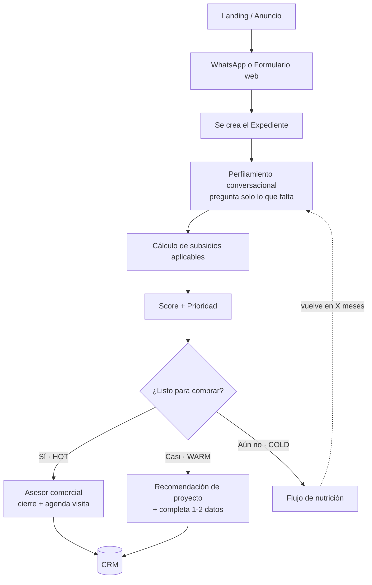

# Flujo de usuario

> El recorrido de un lead, desde que entra hasta que llega (o no) al asesor.

## Flujo principal



## Paso a paso (narrado)

1. **Landing / Anuncio.** El lead hace clic en una pauta (Meta, Google Ads) o entra por la web.
2. **WhatsApp / Formulario.** Aterriza en un canal conversacional. No llena un formulario de 20 campos.
3. **Se crea el Expediente.** El sistema ya sabe de dónde vino (canal, campaña, UTM) y **precarga** lo que puede inferir.
4. **Perfilamiento conversacional.** El sistema pregunta **solo los huecos**: ¿es afiliado? ¿rango de ingreso? ¿ya tiene vivienda? Máximo 3-4 preguntas, en lenguaje natural.
5. **Subsidios.** Con el perfil, calcula qué subsidios aplican (VIS/VIP, Mi Casa Ya, SFV) y cómo cambian la cuota inicial.
6. **Score + Prioridad.** Combina las dimensiones en HOT / WARM / COLD, con su razón.
7. **Decisión de ruteo:**
   - **HOT →** va al asesor con el expediente listo. La conversación es de **cierre y agenda de visita a sala de ventas**.
   - **WARM →** recibe una recomendación de proyecto y se le piden 1-2 datos faltantes para subir a HOT.
   - **COLD →** entra a **nutrición**: contenido y seguimiento para volver cuando cambien sus condiciones.
8. **CRM.** El expediente (mock del CRM) queda registrado con su historia.

## La experiencia, no un interrogatorio

```
❌ Interrogatorio:
   - Nombre completo
   - Cédula
   - Ingresos exactos
   - Estrato
   - Score de crédito
   - ... (20 campos)

✅ Expediente Inteligente:
   "Hola María 👋 Vi que te interesó Los Nogales.
    Para recomendarte lo mejor: ¿estás afiliada a Colsubsidio?"
   → infiere el resto, pregunta solo lo esencial.
```

## Estados del expediente

| Estado | Significado | Acción |
|---|---|---|
| **NUEVO** | Recién creado, sin perfilar | Iniciar conversación |
| **EN PERFILAMIENTO** | Llenando huecos | Preguntar lo que falta |
| **HOT** | Listo para cerrar | Enrutar al asesor |
| **WARM** | Casi listo | Recomendar + completar datos |
| **COLD** | Aún no puede comprar | Nutrir |
| **CERRADO** | Venta o descarte final | Registrar resultado |
