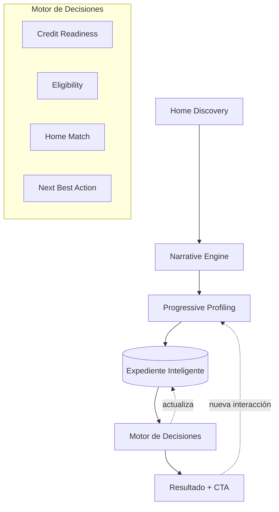

# Requerimiento Funcional — AI Conversational Experience + Narrative Profiling

> Canal WhatsApp del **Expediente Inteligente**. Transforma un lead en expediente vivo usando las capacidades nativas de Meta WhatsApp Business Platform. **No es un chatbot ni un formulario.**
>
> Este documento incluye el requerimiento **y** su análisis + ajustes de encaje (sección [Análisis y ajustes](#análisis-y-ajustes)). Lo que se ancla en la [data real](data-insights.md) se marca ✅; lo que es hipótesis de diseño se marca 🧪.

## Objetivo

Diseñar una experiencia conversacional en WhatsApp que perfile al usuario **de forma invisible** mientras le entrega valor desde el primer mensaje, para:

- perfilar al usuario
- estimar capacidad de compra
- identificar narrativas (motivaciones)
- validar elegibilidad
- recomendar proyectos por afinidad
- decidir el siguiente paso comercial

## Objetivo UX

> El usuario debe sentir que está **descubriendo su hogar ideal**, no que está siendo perfilado. El perfilamiento ocurre de forma invisible.

**Concepto: Home Discovery Experience.** No es un chatbot; es un asistente para descubrir la vivienda ideal.

## Principios

| Principio | Qué significa |
|---|---|
| **Conversación** | No preguntar datos por preguntar. Cada interacción entrega valor. |
| **Progresividad** | Nunca pedir toda la información al inicio. Se construye durante la conversación. |
| **Recompensa inmediata** | Cada bloque de preguntas devuelve un beneficio (capacidad estimada, proyectos compatibles, subsidios). |
| **Perfilamiento invisible** | Las respuestas generan atributos internos sin preguntar directo. Ej.: pulsa 🐶 "Pet Friendly" → narrativa `Pet Lover`, peso 0.94. |

> ⚠️ Matiz de diseño (ver [análisis](#3-consentimiento-invisible-para-preferencias-transparente-para-dinero-y-pii)): "invisible" aplica a **preferencias**. Para datos **financieros y personales** hace falta transparencia y consentimiento (opt-in de Meta + Habeas Data).

## Arquitectura conversacional

## Los 8 componentes — y su mapeo a la arquitectura existente

> El requerimiento **renombra y extiende** motores que ya existen en el repo, y **añade** dos nuevos (Narrative + Feature Store). No se duplica lógica.

| # | Componente | Qué hace | En el repo |
|---|---|---|---|
| 1 | **Home Discovery** | Pantalla inicial: "Descubramos qué proyecto se adapta a tu estilo de vida" | 🆕 entrada del canal WhatsApp |
| 2 | **Narrative Engine** | Clasifica **motivaciones**, no personas (Familia, Pet Lover, Home Office…) | 🆕 nueva dimensión del expediente ([`../datasets/narrativas.json`](../datasets/narrativas.json)) |
| 3 | **Progressive Profiling** | Obtiene info durante la conversación, sin interrogatorio | ↔ doctrina "inferir antes de preguntar" ([`solution.md`](solution.md)) + [`../prompts/advisor.md`](../prompts/advisor.md) |
| 4 | **Credit Readiness Engine** | Capacidad de pago / endeudamiento → Preparado / En proceso / No preparado | ↔ `score_financiero` ([`scoring-engine.md`](scoring-engine.md)) |
| 5 | **Eligibility Engine** | VIS/VIP, subsidios, caja de compensación, beneficios | ↔ segmentación oficial ([`../datasets/segmentacion_caja.json`](../datasets/segmentacion_caja.json)) |
| 6 | **Home Match Engine** | Compatibilidad por **afinidad**, no por precio | ↔ recomendador + `encaje_ICP`, extendido con afinidad de narrativa |
| 7 | **Advisor Copilot** | Resumen ejecutivo automático para el asesor | ↔ [`../prompts/summary.md`](../prompts/summary.md) |
| 8 | **Next Best Action** | Decide: asesor / nutrir / documentos / agendar / esperar | ↔ ruteo HOT/WARM/COLD, versión más rica |

## Narrativas (motivaciones)

Cada narrativa tiene **peso**, **confianza** y **última actualización**. Datos → [`../datasets/narrativas.json`](../datasets/narrativas.json).

| Narrativa | Anclaje |
|---|---|
| 🏠 Primera Vivienda | ✅ segmento **Joven** (menor 39, sin personas a cargo) — **el segmento real más grande**: 23% Joven, 43% cero personas a cargo |
| 👨‍👩‍👧 Familia | ✅ `NO_GRUPO_FAMILAR` > 0, segmento **Básico/Medio** (con personas a cargo) |
| 📈 Inversionista | ✅ (débil) rango salarial alto / ya tiene vivienda (Alto ~0% en la base → raro) |
| 🐶 Pet Lover | 🧪 no está en la base — señal de preferencia (interacción) |
| 💻 Home Office | 🧪 señal de preferencia (interacción) |
| 🌳 Naturaleza | 🧪 señal de preferencia + amenidad de proyecto |
| 🏃 Vida Activa | 🧪 señal de preferencia + amenidad |
| 🚇 Movilidad | 🧪 señal de preferencia + ubicación |
| ✨ Estilo Premium | 🧪 señal de preferencia (choca con base VIS/VIP) |
| 🤝 Comunidad | 🧪 señal de preferencia |

> **Honestidad de datos:** 3 narrativas se **infieren** de la caja (Primera Vivienda, Familia, Inversionista); 7 son **señales de preferencia** que solo existen si el usuario interactúa. No se inventan; se capturan. Ver [análisis](#1-gap-de-datos-narrativas-y-amenidades).

## Perfilamiento invisible — ejemplos

| En vez de preguntar | Mostrar | Narrativa detectada |
|---|---|---|
| "¿Tiene mascotas?" | Imagen de parque canino: _"Porque ellos también hacen parte de la familia."_ Botón "Quiero conocer más" | 🐶 Pet Lover |
| "¿Trabaja remoto?" | Cowork: _"Imagina trabajar sin salir de tu conjunto."_ | 💻 Home Office |
| "¿Tiene hijos?" | Parques / colegios: _"¿Cómo imaginas crecer a tu familia?"_ | 👨‍👩‍👧 Familia |

## WhatsApp Business — features nativas y sus límites

> El sistema usa **exclusivamente** capacidades nativas de Meta. Los límites de plataforma son restricciones de diseño reales, no opcionales.

| Feature | Uso | Límite nativo (respetar) |
|---|---|---|
| **Interactive Reply Buttons** | Hasta 3 acciones rápidas (Descubrir / Calcular subsidio / Hablar con asesor) | Máx **3 botones**, título ≤ 20 caracteres |
| **Interactive Lists** | Selección de narrativas, amenidades, proyectos | Máx **10 filas**, título de fila ≤ 24, descripción ≤ 72 |
| **WhatsApp Flows** | **Mecanismo principal de captura**: perfilamiento, documentos, simuladores, calculadoras, resultados | Formularios multi-pantalla con endpoint de intercambio de datos |
| **Multimedia** | Imágenes, video, PDF, brochure, resumen del expediente | Ancla la "recompensa inmediata" |
| **Templates** | Recordatorios, nutrición, seguimiento, nuevos proyectos | **Pre-aprobados**; obligatorios fuera de la ventana de 24 h |

> 🔑 **Ventana de 24 horas:** fuera de las 24 h desde el último mensaje del usuario, **solo se pueden enviar Templates aprobados**. Por eso la **nutrición** (leads COLD) se implementa con Templates — conecta directo con el flujo de nutrición de [`user-flow.md`](user-flow.md).

## Feature Store — señales

Cada interacción genera señales que alimentan el perfil: `click_pet`, `view_pool`, `likes_cowork`, `view_family`, `download_brochure`… Cada señal actualiza el peso de una o más narrativas y el score de intención.

## Expediente vivo — campos

Cada conversación actualiza un expediente que **siempre evoluciona**, nunca estático:

`datos_personales` · `narrativa_dominante` · `score_financiero` · `score_intencion` · `score_confianza` · `capacidad_de_compra` · `elegibilidad` · `subsidios` · `documentos` · `amenidades_favoritas` · `objeciones` · `timeline` · `proxima_accion`

> Extiende el modelo de [`architecture.md`](architecture.md) y el esquema de [`../database/schema.sql`](../database/schema.sql) con: narrativa, amenidades, objeciones, feature_store y next_best_action.

## KPIs

- Tiempo promedio para completar el expediente · Tiempo hasta perfilamiento
- CTR por narrativa · CTR por CTA
- Conversión a: asesor · visita · subsidio · crédito · venta
- Nivel de confianza del perfil

## Diferenciadores

- No captura datos → **construye un expediente**.
- No hace preguntas → **descubre motivaciones**.
- No clasifica solo por ingresos → **clasifica por narrativa**.
- No entrega un score → **entrega un plan de acción**.
- No vende proyectos → **encuentra el hogar ideal**.
- No es un chatbot → **es un asistente inteligente de compra de vivienda**.

---

# Análisis y ajustes

> Qué encaja, qué falta, y cómo lo anclamos en la realidad. Esta sección es el **enriquecimiento** del requerimiento.

## Encaje con el proyecto — excelente
El requerimiento es la realización en WhatsApp de la doctrina del repo: **"un cerebro, muchas bocas"** (WhatsApp es una boca del mismo modelo canónico), **"inferir antes de preguntar"** (perfilamiento invisible), y **"nadie se descarta"** (nutrición vía Templates). No hay conflicto arquitectónico; hay extensión.

## 1. Gap de datos: narrativas y amenidades
La base real (4.142 compradores) **no tiene datos de amenidades ni de motivación** (no hay columna "pet friendly", "cowork", "parque canino").

**Consecuencia y ajuste:**
- **Narrativas inferibles** (Primera Vivienda, Familia, Inversionista) se anclan en la caja (segmento, grupo familiar, edad). El segmento **Joven / Primera Vivienda es el más grande de la base** → la narrativa dominante real ya está validada.
- **Narrativas de preferencia** (Pet Lover, Home Office, Naturaleza…) son **hipótesis de UX**: solo existen si el usuario interactúa. Sus pesos arrancan heurísticos y se aprenden con el Feature Store. **No se inventan datos** para ellas.
- **Home Match por afinidad necesita amenidades por proyecto**, que **hoy no tenemos estructuradas**. Están en los brochures ([`../recursos/Links_brochures.xlsx`](../recursos/)). → **Pendiente:** extraer amenidades de los brochures y poblar `amenidades` en [`../datasets/proyectos_reto.json`](../datasets/proyectos_reto.json) (hoy el campo existe vacío). Sin eso, Home Match cae a `encaje_ICP` (financiero + segmento), que sí es real.

## 2. Los "engines" se mapean, no se duplican
Ver la [tabla de mapeo](#los-8-componentes--y-su-mapeo-a-la-arquitectura-existente). Credit Readiness = `score_financiero`; Eligibility = segmentación oficial; Advisor Copilot = `prompts/summary.md`; NBA = ruteo enriquecido. Solo **Narrative Engine** y **Feature Store** son verdaderamente nuevos. Esto mantiene el repo coherente.

## 3. Consentimiento: invisible para preferencias, transparente para dinero y PII
"Nunca debe percibir que está siendo perfilado" es correcto para **preferencias** (pet, cowork, parques). Pero:
- Meta **exige opt-in** antes de mensajear por WhatsApp.
- Datos **financieros y personales** en Colombia caen bajo **Habeas Data (Ley 1581 de 2012)**: requieren finalidad y autorización.

**Ajuste:** perfilamiento invisible para señales de preferencia; **transparencia y consentimiento** al pedir ingresos, afiliación o documentos ("esto me sirve para calcular tu subsidio"). Esto además **sube el `score_confianza`** (dato validado > inferido) y hace la solución defendible ante el jurado y ante legal.

## 4. Narrativa como nueva dimensión del score
Se añade `narrativa_dominante` (+ pesos) al expediente y se usa en dos lugares: (a) **Home Match** (afinidad proyecto↔narrativa) y (b) **Advisor Copilot** (la narrativa es el gancho de la conversación de cierre: "muéstrale el parque canino"). No cambia los pesos financieros/afiliación del [scoring](scoring-engine.md); los complementa.

## Pendientes que abre este requerimiento
- [ ] Extraer **amenidades por proyecto** de los brochures → poblar `proyectos_reto.json`.
- [ ] Definir el catálogo de **señales** del Feature Store y su mapeo a narrativas.
- [ ] Diseñar los **WhatsApp Flows** concretos (pantallas de perfilamiento, calculadora de subsidio, resultado).
- [ ] Redactar los **Templates** de nutrición/seguimiento (para enviar fuera de la ventana de 24 h).
- [ ] Registrar la **autorización de datos** (Habeas Data) en el opt-in.
